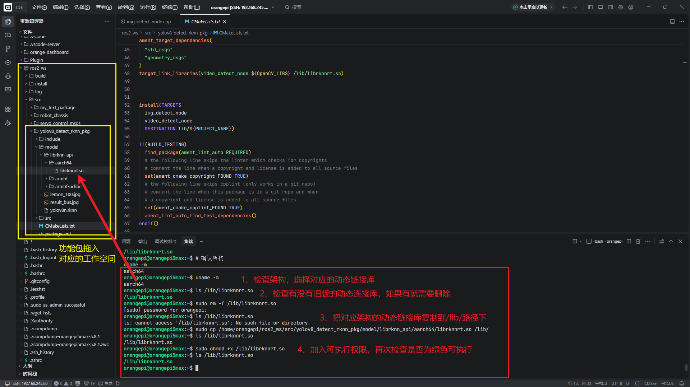
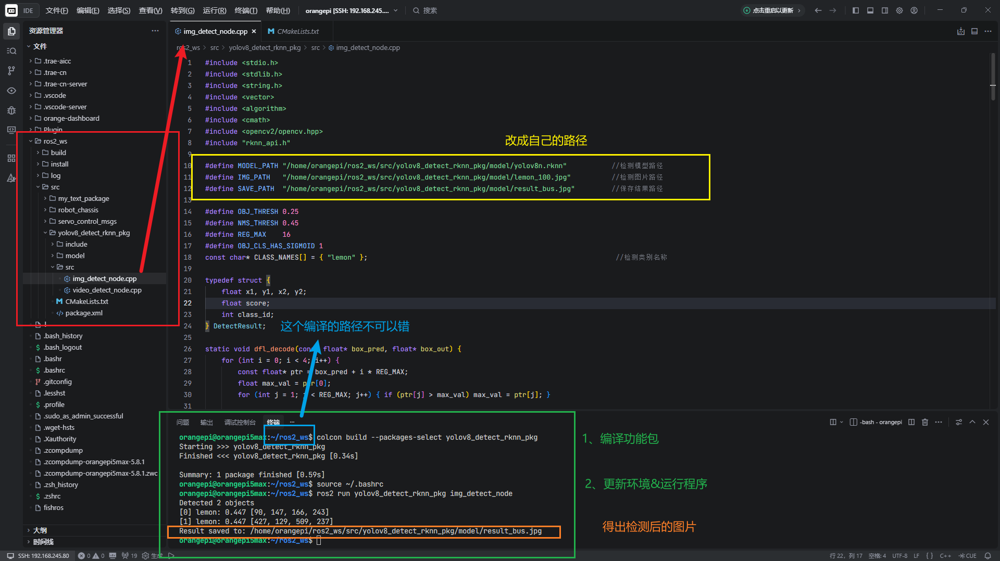
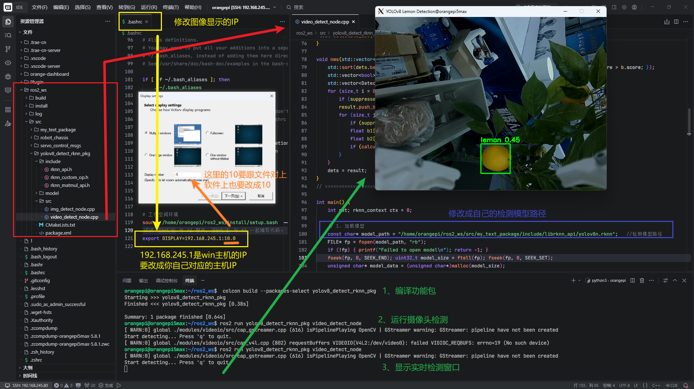

# 🤖 ROS2 YOLOv8 RK3588 目标检测

[](https://docs.ros.org/en/humble/)
[](https://www.rock-chips.com/)
[](https://github.com/rockchip-linux/rknpu2)
[](LICENSE)

> 基于 RK3588 NPU 加速的 YOLOv8 目标检测 ROS2 功能包  
> 支持图片检测与摄像头实时视频流检测

## ✨ 功能特性

| 功能 | 状态 | 说明 |
|:---|:---|:---|
| 🖼️ 图片检测 | ✅ 完成 | 单张图片推理，保存结果 |
| 📹 视频检测 | ✅ 完成 | USB 摄像头实时检测 |
| ⚡ NPU 加速 | ✅ 完成 | RK3588 6TOPS 算力 |
| 🔧 零拷贝优化 | ✅ 完成 | `rknn_create_mem` + `rknn_set_io_mem` |

## 📦环境准备

- ROS2环境安装：[ubuntu系统安装ROS（简单版）V2](https://azitide.github.io/post/ubuntu_ROS.html)

- opencv安装命令行

  ```
  sudo apt update & sudo apt install libopencv-dev python3-openc
  ```

## 🔧rknn环境配置

4.1.1  下载ROS2功能包放入ros2_ws/src的路径，路径如下

```
  ros2_ws
    ├─ build
    ├─ install
    ├─ log
    └─  src
      └─ yolov8_detect_rknn_pkg
          ├─ CMakeLists.txt                 #编译信息文件
          ├─ package.xml
          ├─ src
          │  ├─ img_detect_node.cpp         #图片检测
          │  └─ video_detect_node.cpp       #摄像头检测
          ├─ model
          │  ├─ lemon_100.jpg
          │  ├─ result_bus.jpg
          │  ├─ yolov8n.rknn          #存放检测模型的地方
          │  └─ librknn_api           #动态链接库暂时存放的地方
          │     ├─ armhf-uclibc
          │     │  ├─ librknnmrt.a
          │     │  └─ librknnmrt.so
          │     ├─ armhf
          │     │  └─ librknnrt.so
          │     └─ aarch64
          │        └─ librknnrt.so
          └─ include                  #需要用到头文件
            ├─ rknn_api.h
            ├─ rknn_custom_op.h
            └─ rknn_matmul_api.h

```

4.1.2 检测开发版的架构的，使用对应的动态链接库

```
##检测架构命令行。
uname -m  
##检查/lib/下原先是否有动态链接库。
ls /lib/librknnrt.so
##/lib/下原有动态链接库，需要删除。
sudo rm -f /lib/librknnrt.so
##复制对应的的架构的动态链接库进去/lib/【需要修改为你开发板的librknnrt.so的绝对路径】 
sudo cp /home/orangepi/ros2_ws/src/yolov8_detect_rknn_pkg/model/librknn_api/aarch64/librknnrt.so /lib/
##加入可执行的权限。
sudo chmod +x /lib/librknnrt.so
```



## 🖼️ 图片检测

1、`yolov8_detect_rknn_pkg/src/img_detect_node.cpp`是图片检测程序【修改成你自己对应的路径】

```
#define MODEL_PATH "/home/orangepi/ros2_ws/src/yolov8_detect_rknn_pkg/model/yolov8n.rknn"     //检测模型路径
#define IMG_PATH   "/home/orangepi/ros2_ws/src/yolov8_detect_rknn_pkg/model/lemon_100.jpg"    //检测图片路径
#define SAVE_PATH  "/home/orangepi/ros2_ws/src/yolov8_detect_rknn_pkg/model/result_bus.jpg"   //保存结果路径
```

2、终端进去`ros2_ws`工作空间路径下，进行编译

```
 colcon build --packages-select yolov8_detect_rknn_pkg
```

3、运行ros2图片检测

```
source ~/.bashrc
ros2 run yolov8_detect_rknn_pkg img_detect_node
```



## 📹摄像头检测

环境前提：开发板一般安装服务器版本，没有后端，我这里用的是PC电脑ssh远程连接到开发板ubuntu

```plain
显示原理
Linux 程序 (OpenCV imshow)  →  X11 协议  →  Windows XLaunch 显示
         (服务器端)              (网络)           (客户端显示)
```

- Windows 安装 XLaunch：https://sourceforge.net/projects/vcxsrv/

- linux的`~/.bashrc`文件最后一行添加

  ```
  export DISPLAY=192.168.1.100:0.0  #win显示端主机的IP：端口
  ```

------

开始检测：

1、`yolov8_detect_rknn_pkg/src/video_detect_node.cpp`是摄像头检测程序【main程序修改成你自己对应的检测模型路径】

```
const char* model_path = "/home/orangepi/ros2_ws/src/my_text_package/include/librknn_api/yolov8n.rknn";
```

2、终端进去`ros2_ws`工作空间路径下，进行编译

```
 colcon build --packages-select yolov8_detect_rknn_pkg
```

3、运行ros2摄像头检测

```
source ~/.bashrc
ros2 run yolov8_detect_rknn_pkg video_detect_node
```



------

